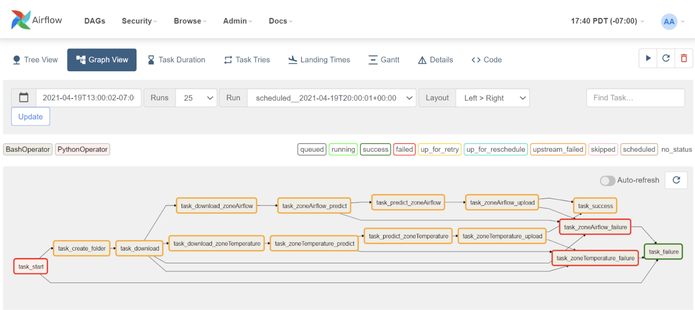

# airflow-data-pipeline

## Summary (Include Screenshots): 
Airflow is an efficient open-source workflow management platform. A workflow consists of ‘Task’ and ‘Dependency’, which are defined in Python. Airflow uses directed acyclic graphs (DAGs) to manage workflow orchestration, and manages the scheduling and execution of all defined workflows. The following images show basic interfaces of Airflow:
##### (1) This interface is the main page of Airflow, which shows all existing workflows.

###### (2) This interface is the ‘Tree View’ for a workflow. There are several columns in this interface. Each column is represented for a workflow executed in a scheduled time. The red circle means this task is failed due to various reasons. The green circle means this task is successful as expected.

###### (3) This interface is the ‘Graph View’ for a workflow. It shows ‘Dependencies’ within a workflow. Each rectangle is represented for a ‘Task’, which is the basic element of the workflow.

###### (4) This interface shows the running information for each execution.

****
'DAG', directed acyclic graph, is the most important part in the Airflow. 'myDAGtest.py' is the DAG file of this project, and the workflow in this project is:

****
Python files cannot be executed in 'DAG' directly. The way to run python files is to use 'BashOperator' in the Airflow. 'BashOperator' provides a way to execute commands in a Bash shell, which can also take input parameters. 'task_download.py', 'task_predict.py', 'task_upload.py' and 'task_upload_failure.py' are four python files which are expected to run within the 'BashOperator'. 'remove_cache.sh' is used to remove cache for each workflow, which can save memory for the server. There are five steps in the workflow, which is implemented by the previous 'BashOperator':

## Relationship With Other Services: 
   Airflow works automatically in the docker and provides the ’Hunting service’ with daily prediction data. Prediction results will be defined as '-1' if there is anything wrong with the original device data. All the data is uploaded preserved in the AWS MySQL database.

## Directions:
   ##### (1)'DatabaseSetting.yaml' needs to be changed whenever creating a new project.
   ##### (2)Change the 'start_date'(in dag) in 'myDAGtest.py' before starting a new schedule.
   ##### (3)Run command 'airflow db init' when DAG files be updated. This command is used to refresh the database in Airflow to update all changes.
   ##### (4)Airflow runs jobs at the end of an interval, not the beginning. This means that the first run of the job is going to be after the first interval. For example, a daily job(which starts at 0:00 a.m.) will be executed in the next day 0:00 a.m. .
   ##### (5)The ML model is placed under the 'Models' file. 'zone_airflow_model.joblib' is for the prediction of 'zoneairflow' devices, and 'zone_temperature_model.joblib' is for the prediction of 'zonetemperature' devices.
   ##### (6)The Order of the prediction labels does not matter, and label names can be changed in the 'ML_labels.yml' under 'Setting' file.
